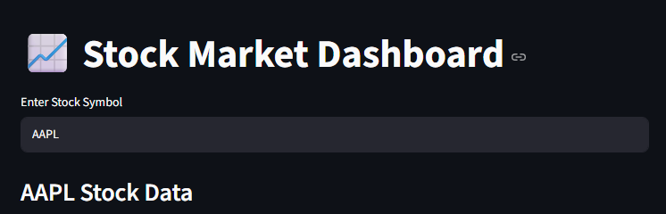
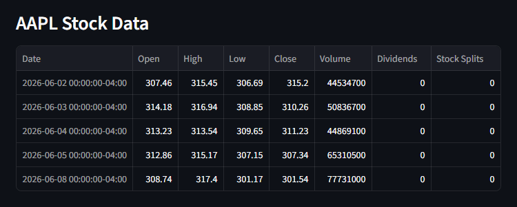
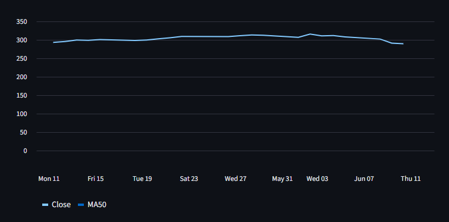
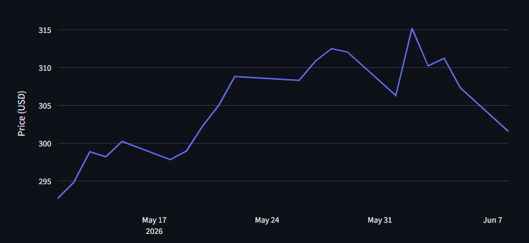
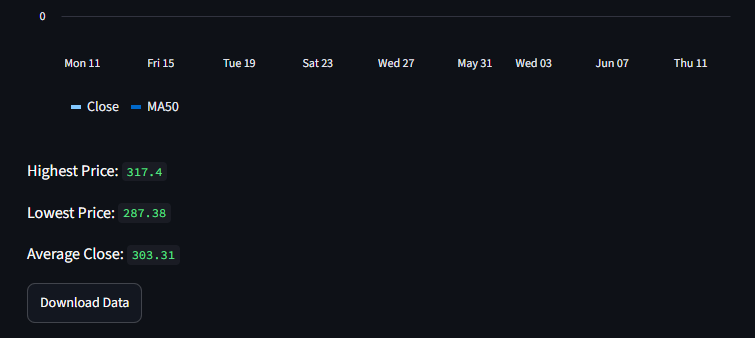
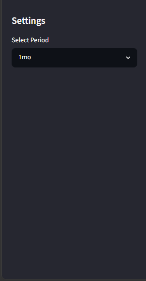

# Intern Id: CITS2067
# Stock-Market-Dashboard
A Stock Market Dashboard built using Python, Streamlit, Yahoo Finance API, Pandas, and Plotly. This project allows users to view stock market data, analyze trends, calculate moving averages, and download stock data as CSV files.

## 🚀 Features
Search stocks using stock symbols (AAPL, TSLA, MSFT, etc.)

View historical stock data

Interactive stock price charts

50-Day Moving Average (MA50)

Display Highest, Lowest, and Average Closing Prices

Download stock data as CSV

Select different time periods (1 Month, 3 Months, 6 Months, 1 Year, 5 Years)

## 🛠 Technologies Used
Python

Streamlit

Pandas

Plotly

yFinance
## 📂 Project Structure
    Stock-Market-Dashboard/
    │
    ├── app.py
    ├── stock_analysis.py
    ├── charts.py
    ├── requirements.txt
    └── README.md

## ⚙ Installation
### 1. Clone the Repository
    git clone https://github.com/your-username/stock-market-dashboard.git

### 2. Move to Project Directory
    cd stock-market-dashboard

### 3. Install Dependencies
    pip install -r requirements.txt

### 4. Run the Application
    python -m streamlit run app.py

## 📊 How to Use
1.Open the dashboard in your browser.

2.Enter a stock symbol (e.g., AAPL).

3.Select a time period from the sidebar.

4.View stock data and charts.

5.Analyze moving averages and statistics.

6.Download stock data as a CSV file.

## 📈 Dashboard Features
### Stock Data Table
Displays historical stock data including:

Open Price

High Price

Low Price

Close Price

Volume

### Moving Average Analysis
50-Day Moving Average (MA50)

Helps identify stock trends

Statistical Analysis
Highest Price

Lowest Price

Average Closing Price

### CSV Export
Download stock data for further analysis

## 📷 Screenshots
### Dashboard Home

## Stock Analysis

## Moving Average Analysis

### Interactive Chart

## 🎯 Future Improvements
Multiple stock comparison

Technical indicators (RSI, MACD)

Real-time stock updates

Portfolio tracking

Dark Mode

## 👨‍💻 Author
Karavandla Varun kumar

Aspiring Software Developer passionate about Python, Data Analytics, Machine Learning, and Web Applications.

GitHub Profile: https://github.com/matteddulamayuri24-creator

## 🤝 Support
If you like this project:

⭐ Star this repository

🍴 Fork this repository

📢 Share it with others

🐛 Report bugs through Issues

💡 Suggest improvements and new features

Your support helps improve the project and encourages further development.
